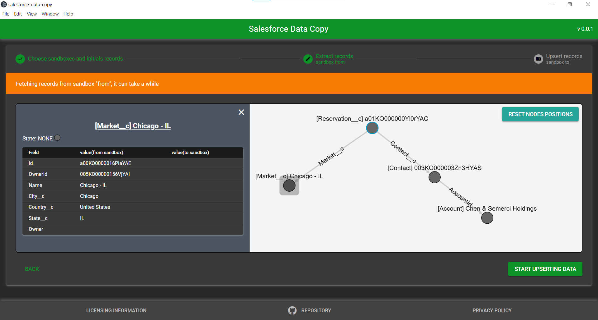

# Installers

Installer files are available under the latest release -> Assets:

- Windows
  - _salesforce-data-copy-{versionNumber}.Setup.exe_ main installer
  - _salesforce-data-copy-win32-x64-{versionNumber}.zip_ zip alternative
  - _salesforce_data_copy-{versionNumber}-full.nupkg_ Nuget package alternative for windows users
- Mac
  - _salesforce-data-copy-darwin-arm64-{versionNumber}.zip_
- Linux
  - _salesforce-data-copy_{versionNumber}_amd64.deb_ for linux users
  - _salesforce-data-copy-linux-x64-{versionNumber}.zip_ zip alternative for linux users

# Install the dependencies

```bash
yarn
# or
npm install
```

## Start the app in development mode (hot-code reloading, error reporting, etc.)

```bash
quasar dev
```

## Build the app for production

```bash
quasar build
```

# Test during developpment

If you don't have your own orgs with data ready you can create scratch orgs from a Developer Org following the instructions in the [lwc-recipes repository](https://github.com/trailheadapps/lwc-recipes?tab=readme-ov-file#installing-the-app-using-a-scratch-org) to make a source org and target org.

Don't import the sample data on the target org if you want o test the data transfer with this app.

# Information for updating dependencies:

- chalk can't be in version 5 with typescript or a build tool
